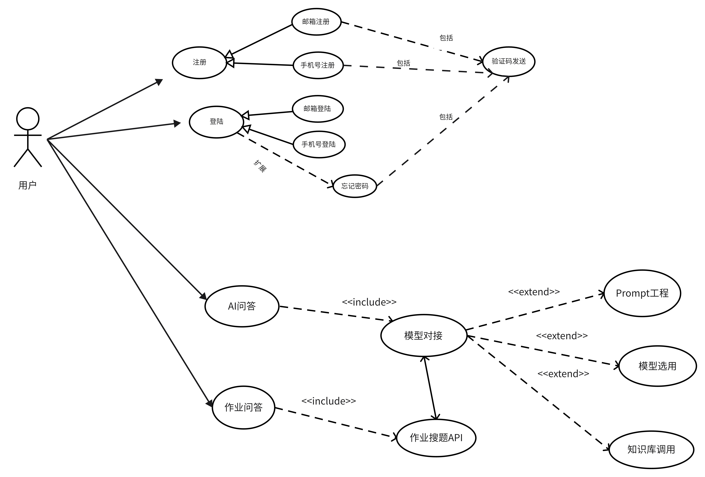

# EduMindAI 智慧AI助手
## 简述
EduMindAI 是一个基于大语言模型的智能助手，主要的目标人群是学生以及老师
## 版本信息
### 版本 1.0.0

#### 概述
版本 1.0.0 采取多模型的策略，通过使用大语言模型，支持模型切换，以及支持文本生成图片。

#### 功能
1. **多模型支持**：系统使用多个大语言模型，根据不同的应用场景进行切换，以提高效率和准确性。
2. **模型切换**：允许在运行时切换语言模型，以便根据实时需求进行调整。
3. **文本生成图片**：支持将文本内容生成为图片格式，以满足特定场景的需求。

### 版本 1.1.0

#### 概述
版本 1.1.0 在 1.0.0 基础上进行更新迭代，添加了声音转文字功能。

#### 功能
1. **声音转文字**：系统具备声音识别功能，能够将用户的语音输入转换为文字格式。

### 版本 1.3.0

#### 概述
版本 1.3.0 在 1.1.0 基础上添加了作业显示及做题功能，并支持知识库调用。

#### 功能
1. **作业显示与做题**：系统能够展示作业内容，并支持用户在系统内完成相关题目。
2. **知识库调用**：系统能够调用知识库，为用户提供更多相关信息。

### 版本 2.0.0

#### 校园AI助手

#### 概述
版本 2.0.0 以LLM大模型的知识库为基础，构建了一个校园助手，具备以下功能：

#### 功能
1. **公众号内容问答**：用户可以向校园AI助手询问学校公众号的内容，如放假通知等。
2. **课程知识库问答**：用户可以询问课程相关信息，如TCP三次握手四次挥手的实现方式等。
3. **信息查询**：支持用户查询课程安排、讲座信息等。

### 版本 2.1.0

#### 口语训练与评分系统

#### 概述
版本 2.1.0 实现了口语训练与评分系统，具备以下功能：

#### 功能
1. **口语交互**：用户可以通过系统进行口语交流，进行动态互动。
2. **口语评测**：系统能够对用户的口语表达进行评测。
3. **评测分析**：系统对评测结果进行分析，提供评分以及相关分析报告。

**当前版本**V 1.0.0 

### 演示
[点击查看演示视频](https://nanfangshaonian.feishu.cn/file/VTfDbgp2goPulgxvIF0c31eUnnb)  

## 项目亮点
1. **多模型支持**：系统使用多个大语言模型，根据不同的应用场景进行切换，以提高效率和准确性。
2. 
## 设计

### 应用架构设计

### 业务设计

上图是这个程序V 1.0.0 版本的流程图以及用例图

### Sql 设计

### API设计

**在线API文档** [点击查看](https://apifox.com/apidoc/shared-2f553a3b-f6a3-4c71-9d1d-591e4691c4fd)

**离线查看**

- 本程序提供openapi文档文件,支持导入Postman,Apifox,Apipost等主流的调试工具,在doc/api文件夹下motion.openapi.json文件
- 提供API规范说明以及接口说明文档,在doc/api文件夹下的API规范PDF文件

## Get Started

### 传统环境下部署
#### 环境要求:
确保本机已经安装了JDK 21, Postgresql 16, Redis 7.0.8, Minio 2022-04-16T04-26-02Z , MongoDB 7.0
1. **初始化数据库**: 进入doc/sql文件夹,根据init.sql脚本文件导入数据库

2. 配置**application-local.yml**文件:
    1. **数据库配置**: 修改application-prod.yml文件中的数据库配置,将数据库的url,username,password修改为你自己的数据库配置
    2. **Redis配置**: 修改application-prod.yml文件中的redis配置,将redis的host,port,password修改为你自己的redis配置
    3. **Minio配置**: 修改application-prod.yml文件中的minio配置,将minio的endpoint,accessKey,secretKey修改为你自己的minio配置
    4. **MongoDB配置**: 修改application-prod.yml文件中的mongodb配置,将mongodb的host,port,username,password,database修改为你自己的mongodb配置
    5. **讯飞接口配置** : 修改application-prod.yml文件中的讯飞接口配置,将讯飞接口的appId,apiKey,apiSecret修改为你自己的讯飞接口配置

3. 配置**application.yml**文件:
    1. 选择环境 active prod

4. **启动程序**: 启动程序,在项目根目录下执行`mvn spring-boot:run`命令,程序会自动启动
### 使用docker部署

1. **构建环境镜像**:
    1. 进入doc/docker/evn 文件夹
    2. 执行`docker build -t evn:latest .`命令构建环境镜像,此镜像包含JDK 21, Postgresql 16, Redis 7.0.8, MongoDB 7.0, Minio 2022-04-16T04-26-02Z

2. **构建程序镜像**:
    1. 如果域名回调地址不变情况下: 进入doc/docker/run 文件夹 执行`docker build -t run:latest .`命令构建程序镜像

    2. 如果域名回调地址改变情况下:
        1. 修改 **application.yml** 文件中的回调地址,将域名换成你的域名,并确保选择环境 active docker
        2. 执行`mvn -U clean package -Dmaven.test.skip=true`命令打包
        3. 将jar放入doc/docker/run 文件夹下(确保jar名称为 edumindai.jar)

3. **运行镜像**:
    1. 创建共享网络: `docker network create evn_net`
    2. 运行环境镜像 : `docker run -d --network=evn_net -p 3306:3306 -p 6379:6379 -p 27017:27017 -p 9000:9000 --name evn evn:latest`
    3. 运行程序镜像: `docker run -d -p 443:443 --network=evn_net --name run run:latest`
